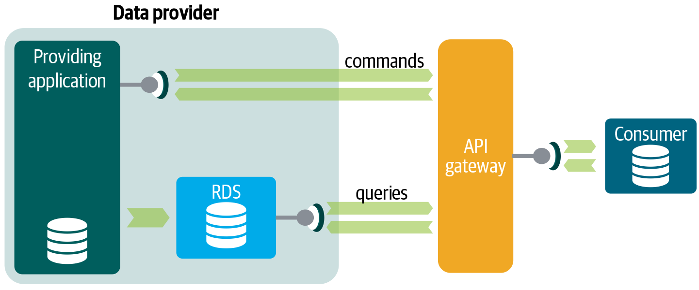

# Tech 258

## APIs

### What are APIs?
APIs (*Application Programming Interfaces*) serve as bridges that enable different software applications to communicate and share data with each other. 
They define the rules and formats for this interaction, simplifying access to complex systems and services for developers. 
APIs follow standard protocols like REST or SOAP (*Simple Object Access Protocol is a standards-based web services access protocol*), 
ensuring compatibility and ease of integration. 

#### How are APIs used?
* **Integration:** APIs enable applications to seamlessly connect with external systems and services, enhancing functionality.
* **Efficiency:** They save developers time by providing pre-built features and resources, allowing focus on core development.
* **Scalability:** APIs facilitate scaling by offloading tasks to external services, preventing server overload.
* **Specialization:** They grant access to specialized services, enriching applications with advanced capabilities.
* **Flexibility:** APIs offer flexibility in choosing tools and services, allowing customization to specific needs.

*The diagram below showcases the data transfer process in API communication.*<br>


### What is a REST API? 

A REST API, or a *Representational State Transfer*, is a software architecture that imposes conditions on how an API should work.
REST is more flexible and allows applications to exchange data in multiple formats, compared to its predecessor, SOAP.

#### What makes an API RESTful? 

RESTful APIs are ones that adhere to the constraints defined by the 6 rules of REST. 
<br>These are:
* **Statelessness:** Every request contains all necessary data; server does not store client state between requests, simplifying server implementation and improving scalability.
* **Cacheability:** Responses can indicate whether they can be cached, reducing server load and improving performance by serving repeated requests from cache.
* **Client-Server Architecture:** Decouples client and server, enabling them to evolve independently and improving scalability.
* **Uniform Interface:** Consistent interface with standard methods (e.g., GET, POST) and data formats (e.g., JSON, XML) for better interoperability and ease of use.
* **Layered System:** This principle requires that messages between the client and target server should always be formatted and processed the same way, regardless of layers that sit between them. Additional layers should not affect client-server interactions.
* **Code on Demand:** If desired, an API can send computer code to clients in its response. This empowers the client to run the code in its own backend.

### What is HTTP? What does it stand for? 

HTTP, or *HyperText Transfer Protocol*, is the computer communication protocol used for most communication on the world wide web.
Operating on a request-response model, HTTP involves a client (like a web browser) sending a request to a server for a particular resource (such as a web page). 
The server then responds with the requested resource and an HTTP status code, indicating the success or failure of the request.

#### What is HTTPS?
HTTPS (*Hypertext Transfer Protocol Secure*) is an extension of the Hypertext Transfer Protocol. 
It uses encryption for secure communication over a computer network, and is widely used on the Internet. 
In HTTPS, the communication protocol is encrypted using Transport Layer Security or, formerly, Secure Sockets Layer.

### The HTTP request structure

<br>**The HTTP request structure is as follows:**
* **Request Line:** The first line is the request line, which contains the HTTP method, the requested resource (URL or URI), and the HTTP version.
* **The HTTP header:** This allows for additional information to be passed between server and client such as cookies, information about the authorization token, or user agent using a special string that helps server identify client browser and OS version.
* **Body:** Some HTTP requests include a message body (*which is optional*), particularly for requests that contain data, such as POST or PUT requests. The body contains the payload of the request, such as form data or JSON/XML data.

An example of a completed HTTP request would be:
```
POST /cgi-bin/process.cgi HTTP/1.1
User-Agent: Mozilla/4.0 (compatible; MSIE5.01; Windows NT)
Host: www.tutorialspoint.com
Content-Type: application/x-www-form-urlencoded
Content-Length: length
Accept-Language: en-us
Accept-Encoding: gzip, deflate
Connection: Keep-Alive

licenseID=string&content=string&/paramsXML=string
```

### The HTTP response structure

<br>**The HTTP response structure is as follows:**
* **A status line.** This contains the HTTP version, a status code, and a reason phrase.
* **A series of HTTP headers, or header fields.** These are optional headers that provide additional information about the response.
* **A message body, which is usually needed.** This contains either the resource requested by the client, or some information about the status of the action requested by the client.

An example of a completed HTTP response would be:
```
HTTP/1.1 200 OK
Content-Type: text/html; charset=utf-8
Content-Length: 112
Date: Sat, 16 Apr 2024 12:00:00 GMT

<!DOCTYPE html>
<html>
<head>
    <title>Example Page</title>
</head>
<body>
    <h1>Hello, World!</h1>
</body>
</html>
```

### What are the 5 HTTP verbs? And what does each do?
The five primary HTTP verbs, also known as HTTP methods, are:
* **GET:** Retrieves data from a specified resource.
* **POST:** Submits data to be processed to a specified resource.
* **PUT:** Updates a resource on the server.
* **DELETE:** Removes a specified resource from the server.
* **PATCH:** Applies partial modifications to a resource.

### What is "statelessness"?

**Statelessness -** This means that every request from a client to a server must include all the information required for understanding and satisfying the request. 
The server doesn't need to store any data regarding the client's past interactions between requests.

### Example of stateless HTTP request:

**GET Request for a Web Page:**

- The client sends a GET request to fetch a web page.
- The server replies with the requested page.
- Each request is self-contained, containing all necessary information for the server to respond.

```
GET /homepage HTTP/1.1
Host: example.com
User-Agent: Mozilla/5.0 (Windows NT 10.0; Win64; x64) AppleWebKit/537.36 (KHTML, like Gecko) Chrome/97.0.4692.71 Safari/537.36
Accept: text/html,application/xhtml+xml,application/xml;q=0.9,image/webp,image/apng,*/*;q=0.8
Accept-Encoding: gzip, deflate, br
Connection: keep-alive
```

### Example of stateful HTTP request:

**Login Request:**

* The client sends a POST request to log in.
* The server verifies credentials and establishes a session.
* Subsequent requests may include session tokens to maintain authentication.

```
POST /login HTTP/1.1
Host: example.com
User-Agent: Mozilla/5.0 (Windows NT 10.0; Win64; x64) AppleWebKit/537.36 (KHTML, like Gecko) Chrome/97.0.4692.71 Safari/537.36
Content-Type: application/x-www-form-urlencoded
Content-Length: 29

username=myusername&password=mypassword
```

### What is caching?

Caching is the process of storing frequently accessed data in a temporary storage location, known as a cache. 
It's done to reduce latency, improve performance, and minimize the need to access the original data source. 
This occurs at various levels, such as browser cache, proxy servers, application-level cache, and database cache.


