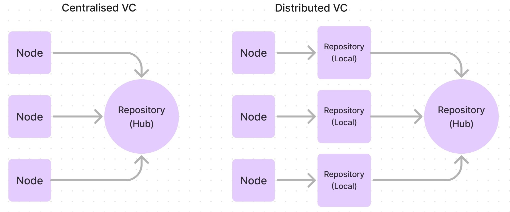
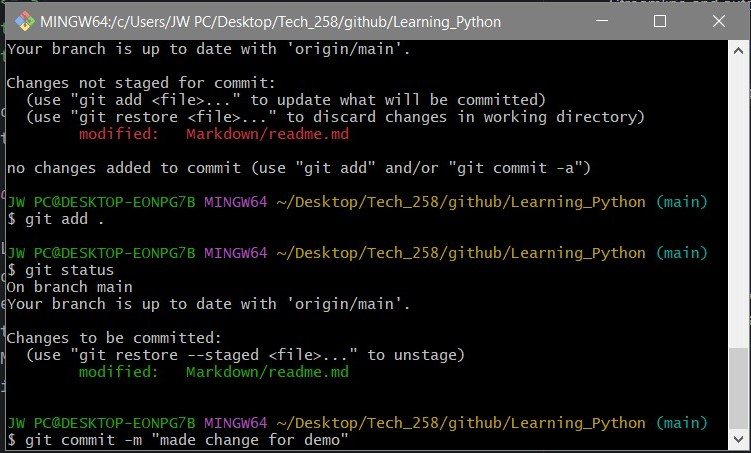
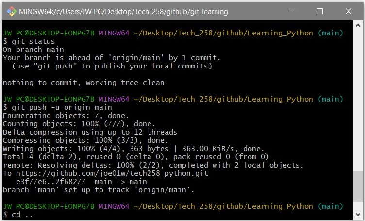

# Tech 258
## Git

#### What is version control? 
Version control is the ability to track changes made on a project, as people and teams collaborate on projects together.
 This is done through a VCS, or a version control system. A VCS tracks the history of changes.
  This means that when developers make changes to the project, any earlier version of the project can be recovered at any time.

Developers can review project history to find out:
* Which changes were made?
* Who made the changes?
* When were the changes made?
* Why were changes needed?

#### What is git, how does it work? 
Git is a version control system that tracks changes in files. It maintains a record of modifications, enabling collaboration and easy reversal of changes. 
It works by taking snapshots of the project's files and allows users to merge changes made by multiple contributors. 
The snapshot system means the git is more efficient and uses less resources than other VCSs.

### Showcase the basic git command flow. Explain what each command does and showcase the expected output: 

`git init` 
 This command to initialize a new repository. When you run git init in a directory, Git creates a new .git subdirectory inside that directory, which contains all the necessary files for the repository. 
This includes configuration files, object databases, and other metadata.
 

`git status` 
 This command displays the current state of the repository. 
When you run git status, Git provides information about which files have been modified, which files are staged for commit, and which files are untracked.

`git add` 
 This command used in Git to add changes in the working directory to the staging area. The staging area is a temporary storage area where you can prepare changes before committing them to the repository.
When you run git add, you specify the files or directories you want to add to the staging area.

`git commit` 
  This command is used to save the changes you've made to the files in your repository. 
When you run git commit, you create a new commit containing the changes that were previously staged using git add.
A commit in Git represents a snapshot of the repository at a particular point in time.

`git commit -m "*your comment here*"`
  This command is the commit command with the ability to add a comment to your changes, making documentation very easy.

### Showcase what `git log` and `git diff` do 

`git log`
  This command displays the commit history of a repository. 
When you run git log, Git presents a chronological list of commits, starting with the most recent commit and proceeding backwards in time.

`git diff`
 This command is used to display the differences between the changes in the working directory and the changes that have been staged but not yet committed (in the staging area).

### What is `.gitignore` and why should we use it?
This command act as a blacklisting feature, so certain files or directories in a Git repository can be ignored.
This can be so Git doesn't recognize temporary folders, or folders with sensitive information.

## Distributed Version Control

### What's the difference between centralised and distributed version control?

Centralised VCs can have issues between nodes that commit at the same time. 
As well as this, if the main repository hub is down, then no commits can be made.

Distributed VCs fix these issues, by introducing separate repositories per node. 
This gives each node a full copy of the repository, allowing offline work and faster operations. 
Distributed VCs also excel in branching, merging, and decentralized collaboration.

### What is GitHub?

GitHub is an online platform built around Git, allowing distributed version control.
It is a platform focused on collaboration, and allows people to create, store, manage and share their code. 

#### Competitors of GitHub

* GitLab
* Bitbucket
* Red Hat Ansible Automation Platform
* Azure DevOps

### How do you link a local repo to a remote repo on GitHub?

**Step 1:** Ensure that you have files that you have already commited to the local repository, using `git commit -m "your comment here"`
You can check this by using the command `git status`. This is shown in the image below.

**Step 2:** Next, use the command `git push -u origin main`
  This pushes the updated version to the main repository hub, and in this case, is GitHub 

