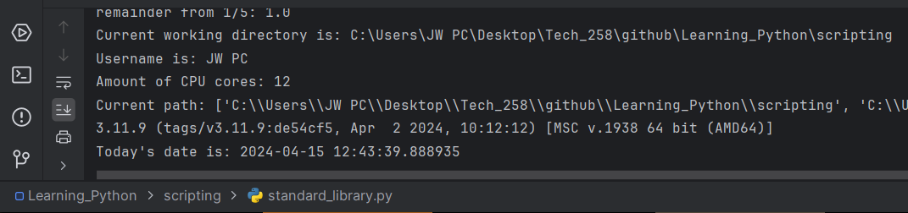

# Tech 258

## Scripting

### What is Scripting?

Scripting involves creating scripts, which are sequences of commands written in a programming language. These commands are used to automate tasks or regulate the behavior of software applications.
One of the key features of scripts is that they provide instructions that are read and executed by another program while it is running.

#### How is it different to Programming?

Scripting is a specific type of programming, programming is a blanket term encompasses the creation of software applications or systems from scratch. 
So all scripting is programming, but not programming is scripting.


## What are the packages in the standard Python library?

### random
This package adds the ability to roll random numbers, as a float, or as an integer within a set limit.
<br>Example commands can be:
<br>`print(random.random())`
<br>`print(random.randrange(1, 11))`

### math
This package adds more complex maths functions.
<br>Example commands can be:
```
num_float = 23.66
print(math.ceil(num_float))
print(math.floor(num_float))
print(math.pi)
print(f"remainder from 1/5: {math.remainder(1, 5)}")
```
### os
This package provides a way to interact with the operating system, and offers functionalities like file and directory operations.
<br>Example commands can be:
* **returning current working directory**
<br> `working_dir = os.getcwd()`
<br> `print(f"Current working directory is: {working_dir}")`


* **get user**
<br>`username = os.environ.get("USERNAME") or os.environ.get("USER")`
<br>`print(f"Username is: {username}")`


* **cpu cores**
<br>`cpu_cores = os.cpu_count()`
<br>`print(f"Amount of CPU cores: {cpu_cores}")`


* **make directory**
<br>`os.mkdir("test_dir")`


### sys
This package allows us access to various functions and variables that are used to manipulate different parts of the Python runtime.
<br>Example commands can be:
<br>`print(f"Current path: {sys.path}")`
<br>`print(sys.version)`


### datetime
This package lets us access the date and time in realtime.
<br>Example commands can be:
<br>`print(f"Today's date is: {datetime.datetime.today()}")`
<br>
<br>
<br>
#### *Below is an image which shows what my run terminal looks like after inputting a few commands from above:* 


## What Python Scripts would a DevOps engineer use/create

* Scripts for monitoring system health and performance metrics using monitoring tools' APIs (Application programming interface)
* General workflow scripts, to automate routine operation tasks
* Scripts to automate data backups 
* Scripts to query a database
* Scripts for the deployment process of applications

