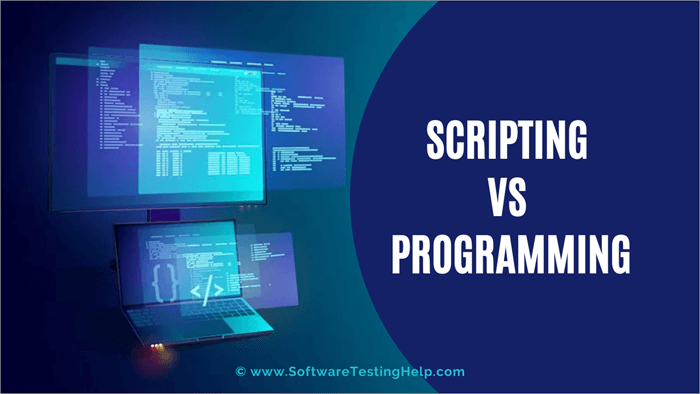

# Tech 258

## Scripting

### What is Scripting?

Scripting involves creating scripts, which are sequences of commands written in a programming language. These commands are used to automate tasks or regulate the behavior of software applications.
One of the key features of scripts is that they provide instructions that are read and executed by another program while it is running.

#### How is it different to Programming?

Scripting is a specific type of programming, programming is a blanket term encompasses the creation of software applications or systems from scratch. 
So all scripting is programming, but not programming is scripting.



### What are the packages in the standard Python library?

#### random
This package adds the ability to roll random numbers, as a float, or as an integer within a set limit.
<br>Example commands can be:
<br>`print(random.random())`
<br>`print(random.randrange(1, 11))`

#### math
This package adds more complex maths functions.
<br>Example commands can be:
```
num_float = 23.66
print(math.ceil(num_float))
print(math.floor(num_float))
print(math.pi)
print(f"remainder from 1/5: {math.remainder(1, 5)}")
```
#### os
This package adds

#### sys


#### datetime


